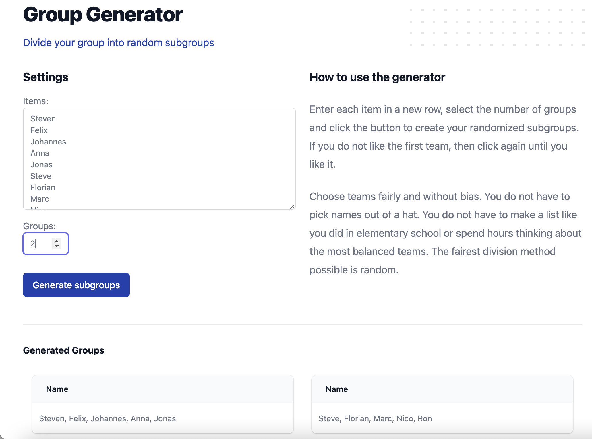

# Group Generator

A web application to split your list of items in random subgroups.



## Getting Started

Install dependencies

```bash
yarn install
```

**Start application**

```
yarn start
```

**Start tailwind viewer**

```
yarn run tailwind
```

**Start storybook**

```
yarn run storybook
```

## License

See the [LICENSE](LICENSE.md) file for license rights and limitations (MIT).